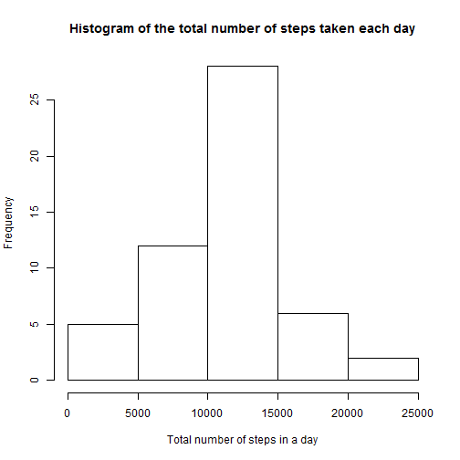
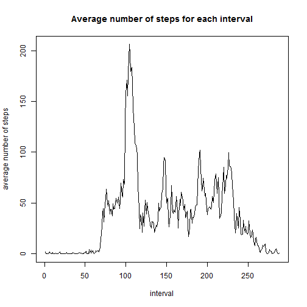
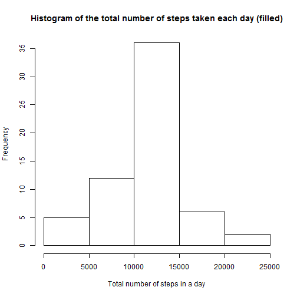
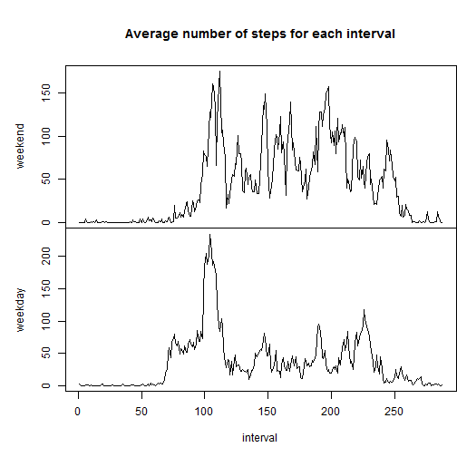

## Reproducible Research: Peer Assessment 1


```r
# group_by() function --> It breaks down a dataset into specified groups of rows. When you then apply the verbs above on the resulting object they'll be automatically applied "by group".
library(dplyr)
```

## A. Loading and preprocessing the data

Show any code that is needed to

1. Load the data (i.e. read.csv())


```r
# set the working directory
setwd("C:/Users/HL/Documents/Coursera/05_Reproducible Research/Week 01/Assignment - Course Project 1")

# set the fileURL
fileURL <- "https://d396qusza40orc.cloudfront.net/repdata%2Fdata%2Factivity.zip"

# download the file
download.file(fileURL, destfile = "./01_Data/01_Raw data/repdata-data-activity.zip")

# date of the download
dateDownloaded <- date()

# unzip the file
unzip("./01_Data/01_Raw data/repdata-data-activity.zip", exdir = "./01_Data/01_Raw data")

# load the csv
data_activity <- read.csv("./01_Data/01_Raw data/activity.csv")
```

2. Process/transform the data (if necessary) into a format suitable for your analysis


## B. What is mean total number of steps taken per day?

For this part of the assignment, you can ignore the missing values in the dataset.

1. Calculate the total number of steps taken per day


```r
# summarise in a table the total number of steps taken per day
total_by_day <- summarise(group_by(data_activity, date), total = sum(steps))

# display the total number of steps taken per day
total_by_day
```

```
## Source: local data frame [61 x 2]
## 
##          date total
##        (fctr) (int)
## 1  2012-10-01    NA
## 2  2012-10-02   126
## 3  2012-10-03 11352
## 4  2012-10-04 12116
## 5  2012-10-05 13294
## 6  2012-10-06 15420
## 7  2012-10-07 11015
## 8  2012-10-08    NA
## 9  2012-10-09 12811
## 10 2012-10-10  9900
## ..        ...   ...
```

2. If you do not understand the difference between a histogram and a barplot, research the difference between them. Make a histogram of the total number of steps taken each day


```r
# histogram of the total number of steps taken each day
hist(total_by_day$total, main="Histogram of the total number of steps taken each day", xlab="Total number of steps in a day")
```



3. Calculate and report the mean and median of the total number of steps taken per day


```r
# summary of the total number of steps taken per day
summary(total_by_day,)
```

```
##          date        total      
##  2012-10-01: 1   Min.   :   41  
##  2012-10-02: 1   1st Qu.: 8841  
##  2012-10-03: 1   Median :10765  
##  2012-10-04: 1   Mean   :10766  
##  2012-10-05: 1   3rd Qu.:13294  
##  2012-10-06: 1   Max.   :21194  
##  (Other)   :55   NA's   :8
```

```r
# mean of the total number of steps taken per day
mean(total_by_day$total, na.rm = TRUE)
```

```
## [1] 10766.19
```

```r
# median of the total number of steps taken per day
median(total_by_day$total, na.rm = TRUE)
```

```
## [1] 10765
```


## C. What is the average daily activity pattern?

1. Make a time series plot (i.e. type = "l") of the 5-minute interval (x-axis) and the average number of steps taken, averaged across all days (y-axis)


```r
# average number of steps taken, averaged across all days
average_steps_byinterval <- tapply(data_activity$steps, data_activity$interval, mean, na.rm = TRUE)

# time series plot
plot(average_steps_byinterval, type = "l", main = ("Average number of steps for each interval"), xlab = "interval", ylab = "average number of steps")
```



2. Which 5-minute interval, on average across all the days in the dataset, contains the maximum number of steps?


```r
# interval number with max number of steps
seq(along.with=average_steps_byinterval)[average_steps_byinterval == max(average_steps_byinterval)]
```

```
## [1] 104
```


## D. Imputing missing values

Note that there are a number of days/intervals where there are missing values (coded as **NA**). The presence of missing days may introduce bias into some calculations or summaries of the data.

1. Calculate and report the total number of missing values in the dataset (i.e. the total number of rows with NAs)


```r
# sum the missing values in the dataset
sum(as.numeric(is.na(data_activity$steps)))
```

```
## [1] 2304
```

2. Devise a strategy for filling in all of the missing values in the dataset. The strategy does not need to be sophisticated. For example, you could use the mean/median for that day, or the mean for that 5-minute interval, etc.


```r
# strategy for filling in all of the missing values in the dataset chosen --> fill the missing values with the mean for that 5-minute interval
```


3. Create a new dataset that is equal to the original dataset but with the missing data filled in.


```r
# create a new data set
data_activity_filled <- data_activity

# create a vector for the steps
steps_missing <- as.vector(data_activity$steps)

# set the NA to 1
steps_missing[is.na(steps_missing)] <- 1

# create a vector for the average steps for each interval
average_steps_byinterval_missing <- as.vector(average_steps_byinterval)

# create a vector for the average steps for each interval for the 61 days
average_steps_byinterval_missing <- rep(average_steps_byinterval_missing, 61)

# set the non NA to 1
average_steps_byinterval_missing[!is.na(data_activity$steps)] = 1

# multiply the new data set where NA = 1 with the mean vector where non NA = 1
data_activity_filled$steps <- average_steps_byinterval_missing * steps_missing
```

4. Make a histogram of the total number of steps taken each day and Calculate and report the mean and median total number of steps taken per day. Do these values differ from the estimates from the first part of the assignment? What is the impact of imputing missing data on the estimates of the total daily number of steps?


```r
# summarise in a table the total number of steps taken per day
total_by_day_filled <- summarise(group_by(data_activity_filled, date), total = sum(steps))

# display the total number of steps taken per day
total_by_day_filled
```

```
## Source: local data frame [61 x 2]
## 
##          date    total
##        (fctr)    (dbl)
## 1  2012-10-01 10766.19
## 2  2012-10-02   126.00
## 3  2012-10-03 11352.00
## 4  2012-10-04 12116.00
## 5  2012-10-05 13294.00
## 6  2012-10-06 15420.00
## 7  2012-10-07 11015.00
## 8  2012-10-08 10766.19
## 9  2012-10-09 12811.00
## 10 2012-10-10  9900.00
## ..        ...      ...
```

```r
# histogram of the total number of steps taken each day
hist(total_by_day_filled$total, main="Histogram of the total number of steps taken each day (filled)", xlab="Total number of steps in a day")
```



```r
# summary of the total number of steps taken per day
summary(total_by_day_filled,)
```

```
##          date        total      
##  2012-10-01: 1   Min.   :   41  
##  2012-10-02: 1   1st Qu.: 9819  
##  2012-10-03: 1   Median :10766  
##  2012-10-04: 1   Mean   :10766  
##  2012-10-05: 1   3rd Qu.:12811  
##  2012-10-06: 1   Max.   :21194  
##  (Other)   :55
```

```r
# summary of the total number of steps taken per day
summary(total_by_day,)
```

```
##          date        total      
##  2012-10-01: 1   Min.   :   41  
##  2012-10-02: 1   1st Qu.: 8841  
##  2012-10-03: 1   Median :10765  
##  2012-10-04: 1   Mean   :10766  
##  2012-10-05: 1   3rd Qu.:13294  
##  2012-10-06: 1   Max.   :21194  
##  (Other)   :55   NA's   :8
```

```r
# mean of the total number of steps taken per day
mean(total_by_day_filled$total, na.rm = TRUE)
```

```
## [1] 10766.19
```

```r
# mean of the total number of steps taken per day
mean(total_by_day$total, na.rm = TRUE)
```

```
## [1] 10766.19
```

```r
# median of the total number of steps taken per day
median(total_by_day_filled$total, na.rm = TRUE)
```

```
## [1] 10766.19
```

```r
# median of the total number of steps taken per day
median(total_by_day$total, na.rm = TRUE)
```

```
## [1] 10765
```

Conclusion: the median is slightly higher after filling the NA with the 5-minute interval mean.


## E. Are there differences in activity patterns between weekdays and weekends?

For this part the weekdays() function may be of some help here. Use the dataset with the filled-in missing values for this part.

1. Create a new factor variable in the dataset with two levels - "weekday" and "weekend" indicating whether a given date is a weekday or weekend day.


```r
# new data set
week_data <- data_activity

# with day of the week
week_data$week <- weekdays(as.Date(week_data$date))

# saturday and sunday = weekend
week_data$week[week_data$week %in% c("Saturday", "Sunday")] <- "weekend"

# monday to friday = weekday
week_data$week[week_data$week != "weekend"] <- "weekday"
```

2. Make a panel plot containing a time series plot (i.e. type = "l") of the 5-minute interval (x-axis) and the average number of steps taken, averaged across all weekday days or weekend days (y-axis). See the README file in the GitHub repository to see an example of what this plot should look like using simulated data.


```r
# dataset with weekend
week_data_weekend <- week_data[week_data$week == "weekend",]

# dataset with weekday
week_data_weekday <- week_data[week_data$week == "weekday",]

# average number of steps taken, averaged across all days
average_steps_byinterval_weekend <- tapply(week_data_weekend$steps, week_data_weekend$interval, mean, na.rm = TRUE)

# average number of steps taken, averaged across all days
average_steps_byinterval_weekday <- tapply(week_data_weekday$steps, week_data_weekday$interval, mean, na.rm = TRUE)

# frame for plot
par(mfrow = c(2, 1))

par(mai = c(0, 1, 1, 0))
# time series plot
plot(average_steps_byinterval_weekend, type = "l", main = ("Average number of steps for each interval"), xlab = "interval", ylab = "weekend", xaxt = "n")

par(mai = c(1, 1, 0, 0))
# time series plot
plot(average_steps_byinterval_weekday, type = "l", main = (""), xlab = "interval", ylab = "weekday")
```



